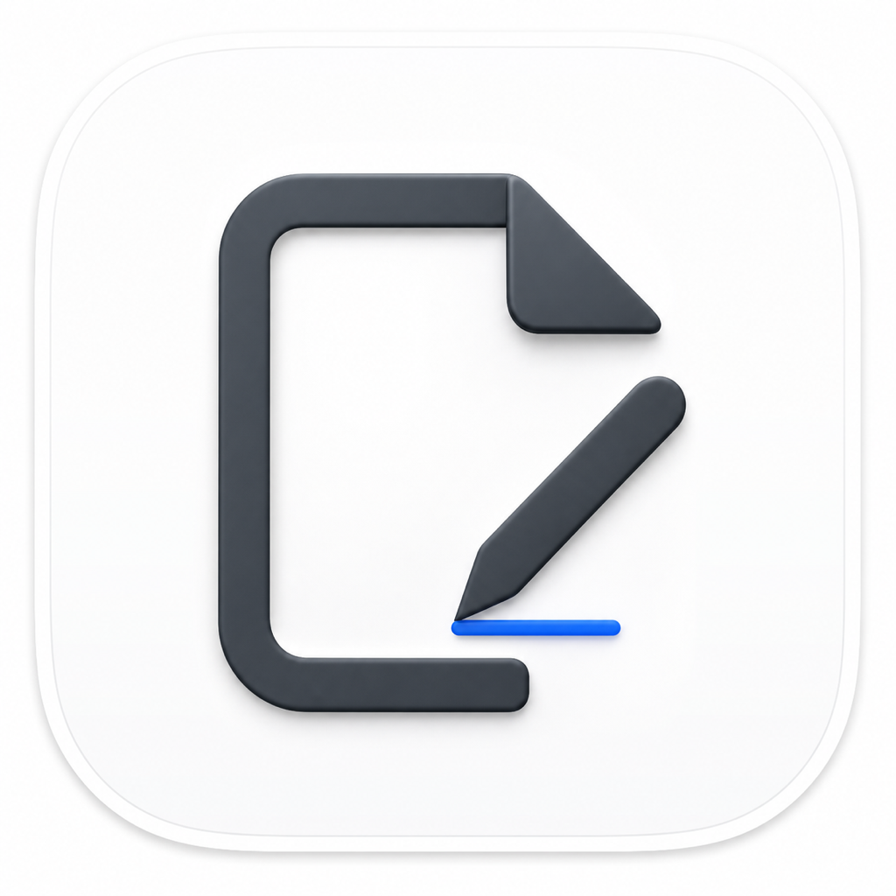
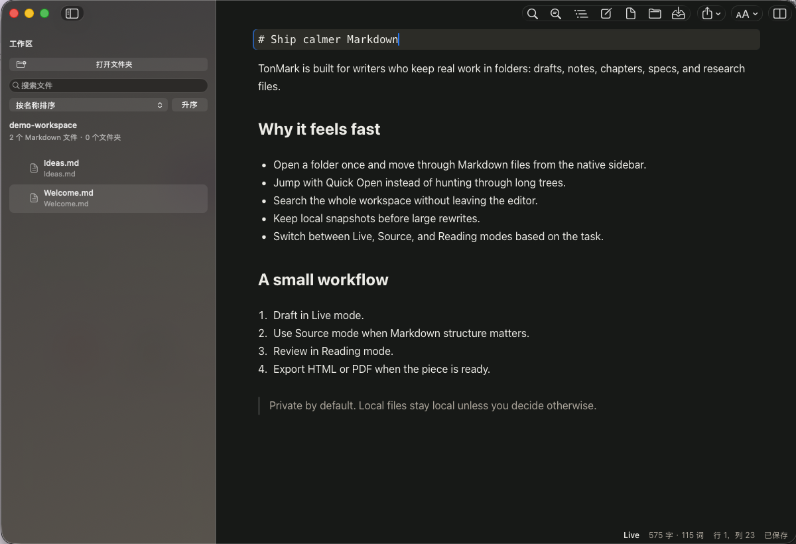

# TonMark

> A native macOS Markdown workspace for writers who live in folders.

[](https://www.apple.com/macos/)
[](https://swift.org/)
[](https://github.com/tonqqsd/TonMark/releases/latest)
[](#license)

TonMark is a fast, local-first Markdown app for macOS. It combines a native AppKit shell with a polished WebKit editor, so you get real macOS windowing, toolbar, Dock behavior, file dialogs, and export, while keeping a flexible Markdown writing surface for long-form work.

<p align="center">
  
</p>



## Why TonMark

Most Markdown editors are either single-file scratchpads or heavy project systems. TonMark is built around the way writers, researchers, and builders actually organize work: one folder, many Markdown files, constant jumping, searching, editing, reviewing, and exporting.

## Highlights

- **Workspace-first writing**: open a folder once and browse Markdown files from a native sidebar.
- **Three focused modes**: Live editing for drafting, Source mode for exact Markdown control, Reading mode for review.
- **Quick Open**: jump to files by name without taking your hands off the keyboard.
- **Workspace search**: search across the whole folder, not only the current document.
- **Snapshots**: save local checkpoints before large rewrites and compare with confidence.
- **Comfortable themes**: light, dark, warm paper, and system-following appearances tuned for long sessions.
- **Export ready**: export the current document to HTML or PDF.
- **Local by default**: your Markdown files stay in your folders. No account, no cloud lock-in.
- **Native macOS details**: toolbar, sidebar, Finder open support, Dock recent workspaces, document associations, and AppKit menus.

## Download

Download the latest DMG from [GitHub Releases](https://github.com/tonqqsd/TonMark/releases/latest).

TonMark currently ships as a locally signed macOS app bundle inside a DMG. If macOS Gatekeeper warns on first launch, open it from Finder with right click -> Open.

## Keyboard-Friendly Workflow

```text
Open folder -> Quick Open -> Write -> Search -> Snapshot -> Review -> Export
```

TonMark is aimed at high-friction writing folders: novels, notes, specs, documentation, research logs, course material, and any project that grows beyond one Markdown file.

## Features In Detail

| Area | What you get |
| --- | --- |
| Navigation | Native workspace sidebar, sortable file tree, Quick Open, document outline |
| Editing | Live editor, Source editor, Reading preview, Markdown blocks, tables, code, quotes |
| Search | Current-document find/replace and full-workspace search |
| Safety | Local snapshots, unsaved-change prompts, workspace path validation |
| Appearance | Light, dark, warm, system theme, adjustable typography |
| Export | HTML and PDF export |
| macOS integration | Finder open, Dock recent workspaces, file associations, native toolbar/menu actions |

## Build From Source

```bash
git clone https://github.com/tonqqsd/TonMark.git
cd TonMark/native/TonMarkNative
swift build
swift test
node --check Resources/Web/app.js
script/build_and_run.sh
```

Create a release DMG:

```bash
cd native/TonMarkNative
script/package_dmg.sh
```

## Tech Stack

- Swift Package Manager
- AppKit
- WebKit
- Swift Testing and XCTest
- Plain JavaScript, HTML, and CSS for the editor surface
- Bundled KaTeX and Mermaid assets for richer Markdown rendering

## Project Layout

```text
native/TonMarkNative/
  Sources/TonMarkNative/  native macOS app shell
  Sources/TonMarkCore/    shared path-security logic
  Resources/Web/          editor UI and bundled web assets
  Resources/AppIcon.png   source image for the macOS app icon
  Resources/AppIcon.icns  bundled macOS app icon
  Tests/                  XCTest and Swift Testing coverage
  script/                 build, test, and DMG packaging scripts
docs/
  images/                 README screenshots
  demo-workspace/         public demo content used for screenshots
```

## Status

TonMark is actively evolving. The current focus is practical writing ergonomics: smoother large-workspace performance, safer file handling, better export, and tighter native macOS integration.

## License

MIT. See [LICENSE](LICENSE).
